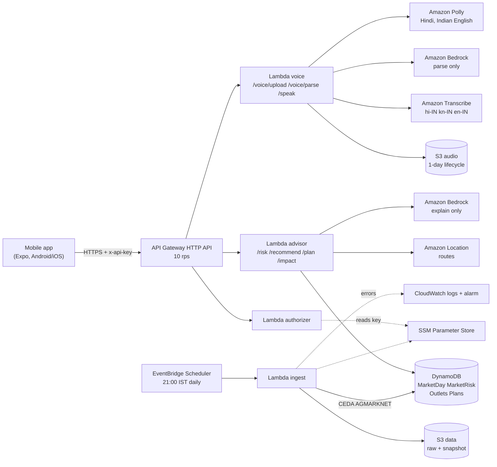

<p align="center"></p>

# AnnaSetu

Every day, a city's mandis turn good food into garbage. AnnaSetu stops the glut before the truck leaves, rescues what's left before it's dumped, and turns the rest into energy, not landfill.

One surplus router, three entry points, centred on the city mandi:

- **Prevent (built):** tells farmer collectives (FPOs) where each load should go (sell fresh, process, donate, feed or compost) using public mandi data, and allocates loads across markets so they don't all crash the same one.
- **Rescue (built; outlets seeded where a real organisation was found, D31):** a trader at a city mandi logs unsold end-of-day stock; the router sends the edible part to food banks or processors before it is dumped.
- **Recover (built; biogas and compost units in 7 states, D31):** what can't be eaten goes to animal feed, biogas or compost instead of landfill. Biogas energy is shown only as a labelled estimate.

The core question it answers: **"Where should this load go today, and what will it actually earn after costs?"**

- Track: Waste and Energy, WeMakeDevs x AWS Environmental Hacks: close the loop on what a city throws away (Rescue, Recover), make the city lighter (Prevent), power it cleaner (Recover: biogas)
- Platform: Android/iOS app (Expo), serverless backend on AWS in ap-south-1, built and deployed with the AWS SAM CLI
- Demo video: TBD
- Android APK: [annasetu.apk](https://expo.dev/artifacts/eas/BygXbwO-2GY_xedOPQo8k5jfkWs5yDkbset9HNDhyO8.apk) (EAS preview build, October 10; talks to the live API)

## Brand

Anna (food) + Setu (bridge): the icon is an arch bridge with a sprout growing from its deck, food carried to where it is needed. The app and the icon share one palette:

| Role | Colour |
| --- | --- |
| Primary (icon background, buttons) | `#215C3B` deep green |
| Surface (icon mark, app background) | `#FAF6EE` light beige |
| Accent (leaves, selected chips) | `#CFE3D4` light green |

Files: `docs/brand/icon.svg` (app icon), `docs/brand/mark.svg` (mark on a transparent background), `docs/brand/icon-256.png`; the app's icon set is in `app/assets/` (iOS icon, Android adaptive foreground, background and monochrome, splash, favicon). Colours match `app/lib/theme.ts`.

| Problem | Decision | Intervention | Impact (shown per load) |
| --- | --- | --- | --- |
| Tomatoes lose value at the farm gate when every grower ships to the same mandi on the same day | Which outlet should each truck go to today? | Rank every reachable outlet by net value per kg after freight, fees and spoilage; spread the day's loads so no market is pushed into a glut; fall back to processors and food banks | Waste avoided (kg, range, estimate) and redirected (kg), always shown separately, plus extra km, diesel, CO2 and water |

---

## 1. Problem

India's fresh produce is lost mostly at or near the farm gate, and mostly because its market value collapses before the food itself spoils. The decision that sets the loss (whether to harvest, where to send the truck) is made with yesterday's local price and a trader's word. The data that could prevent it, AGMARKNET mandi prices and arrivals, is public but is never turned into a per-load decision before loading.

| Fact | Figure | Grade | Source |
| --- | --- | --- | --- |
| Total post-harvest loss, all agri produce | About Rs 1.53 lakh crore a year (2020-22) | Established | [NABCONS 2022](https://insights.dataful.in/articles/from-guava-to-milk-what-food-loss-reveals-about-indias-supply-chains) |
| Fruit and vegetable loss | Fruits 6.02-15.05%, vegetables 4.87-11.61%; 7.36 Mt and 11.97 Mt a year | Established | [Rajya Sabha Feb 2025](https://rsdebate.nic.in/bitstream/123456789/758453/1/PQ_267_07022025_U572_p312_p312.pdf) |
| Where tomato loss happens | 8.37% on farm vs 3.25% at market | Established | [FreshPlaza](https://www.freshplaza.com/asia/article/9756104/india-reports-high-guava-and-tomato-losses/) |
| Where guava loss happens | 11.59% on farm vs 3.46% at market | Established | Same |
| Kolar 2025 glut | Harvest and transport about Rs 70 per 15 kg box vs sale price as low as Rs 30; crops left unharvested | Documented | [Outlook Business](https://www.outlookbusiness.com/explainers/farmers-in-india-struggle-with-falling-tomato-prices-whats-behind-the-price-drop) |
| Same food, different value | Udumalaipettai tomatoes dumped while the same box sells about 5x more across the Kerala border | Documented | [Onmanorama](https://www.onmanorama.com/news/kerala/2025/09/04/tomato-farmers-discarding-produce-roadside.html) |
| Share of fresh produce the cold chain serves | About 10% | Established | [NCCD Sept 2025](https://nccd.gov.in/uploads/ET_in_cold_chain_sector_in_India_v8_3bfe3b8148.pdf) |
| Cold storage built for potatoes | Over 75% of capacity | Established | Same |
| Whole cold chain energy use | About 5 TWh a year, mostly old potato stores | Established | Same |

Scale anchor: 1% of the 19.3 Mt of fruit and vegetables lost each year is about 193,000 tonnes of food. AnnaSetu targets perishables only and makes no claim about a percentage reduction in loss until one is measured.

Root causes software can address: blind dispatch (old local price, hearsay) and herding (a whole belt harvests together and ships to the nearest mandi, so arrivals spike and prices crash). A predictor alone does not fix herding; an allocator does.

## 2. What it does

Four parts around one decision: where should this load go? Rescue and Recover (CLAUDE.md Sections 5 and 9, D19) reuse the same engine with a different entry point: `POST /recommend` with `source: "mandi_unsold"` and the "I have unsold stock at the market" screen. The Impact Ledger headline is kg kept out of landfill = Prevented + Rescued + Recovered; redirected stays separate. Biogas energy shows "not yet estimated" until a yield is sourced (D21).

1. **Glut Radar.** Daily glut risk per reporting market and crop: safe, watch or glut, always as colour + word + icon, with the arrival ratio and price. Tomato runs in `same_day` mode (Section 5), so the radar shows today's risk only and makes no "days early" claims.
2. **Dispatch Advisor (the core).** For one load (crop, quantity, origin, harvest timing) it ranks every reachable outlet by net value per kg after freight, market fee, commission, handling and trip spoilage, with low/mid/high ranges. For a day's loads (`/plan`) it allocates largest first and adds each assignment to that market's expected extra arrivals, so AnnaSetu never pushes a market into glut itself. A market whose risk cannot be checked is listed but never chosen (D17). If harvesting does not pay, it advises harvesting only what has a buyer.
3. **Second Life.** When no fresh market pays, it walks down the food waste hierarchy: processor, then food bank, then animal feed or compost. Never a dump. Hold is offered only for storable crops (tomato is not).
4. **Impact Ledger.** For every decision: **waste avoided** (kg, low/mid/high, labelled "(estimate)") and **redirected** (kg) are shown as two separate numbers and never merged; plus extra km, diesel, CO2 and embedded water. A value that cannot be computed shows "not yet estimated", never zero.

Input is by voice (Hindi, Kannada, Indian English) or a typed form. Bedrock only parses the spoken load and writes a two-sentence explanation from computed facts; deterministic Python decides. AnnaSetu advises, people decide: every recommendation can be overridden and overrides are logged.

## 3. Demo replays (D18)

**Live or Demo (Settings, D34).** Live (the default) uses today's mandi prices from [Agmarknet](https://agmarknet.gov.in), fetched for the markets near you. Agmarknet's public endpoint gives prices only (arrivals need a captcha), so in Live the Glut Radar works from the 3-day price drop and loads are not split across markets. Demo replays the documented Kolar tomato glut of 29 Sep 2023 with the full model.

In Demo the app runs on historical data and says so on every data screen: **"Replaying \<date\> data"**. The loads are **simulated demo loads** (labelled "Demo loads"), and every "what would have happened at the nearest mandi" figure is **model output**, not an observation.

| Replay | Why this day | Observed on that day (CEDA district data) | Documented by |
| --- | --- | --- | --- |
| **2023-09-06** (headline, `config/model.json` `replay_date`) | An arrival-driven glut at Kolar | Kolar 7-day mean arrivals 2,860.3 t vs a baseline of 1,627 t (one prior year, 2022), so R = 1.76 (model level: glut); modal price Rs 6.64/kg, down 28.7% in 3 days from Rs 9.31/kg. Madanapalle, 61.3 km straight line, Rs 10.60/kg | [Deccan Herald, 2023-09-26](https://www.deccanherald.com/india/karnataka/rs-200-to-rs-10-tomato-farmers-hopes-crash-2700660): officials attribute the crash to "the arrival of a large quantity of tomatoes"; Kolar APMC received 4.21 lakh quintals that month vs 2.31 lakh quintals a year earlier. [FreshPlaza, source New Indian Express, 2023-09-04](https://www.freshplaza.com/asia/article/9556365/tomato-prices-down-at-kolar-market/): "the arrival of fresh produce caused a glut" |
| **2025-03-19** (run with `REPLAY_DATE=2025-03-19`) | Kolar's 2025 low, below harvest cost | Kolar modal Rs 4.60/kg, the lowest of Jan-Apr 2025, below the Rs 4.7/kg harvest and transport cost | [Outlook Business](https://www.outlookbusiness.com/explainers/farmers-in-india-struggle-with-falling-tomato-prices-whats-behind-the-price-drop): about Rs 70 per 15 kg box to harvest and transport vs sale price as low as Rs 30; crops left unharvested |

On 2023-09-06 the demo compares the nearest-mandi default with AnnaSetu's allocation of ten loads spread over several markets. **Waste-avoided figures are not stated here**: they need Amazon Location routes cached for the demo origins (D11), and they come from the app. On 2025-03-19 arrivals were normal, so waste avoided there is driven by the placeholder price-below-cost dump share (D12) and always carries "(estimate)". 2025-02-07 was dropped as a demo day because Kolar still paid above harvest cost, which made waste avoided negative.

## 4. Backtest: what the data showed

Snapshot: tomato, 2022-01-01 to 2025-06-30, seven district aggregates (`data/snapshot/ceda_tomato_2022-01-01_2025-06-30.csv`, sha256 `11890d38...f415`). Results JSON (each file separates observed values from model output) is not kept in git: the latest runs (market-level run 937fb04f9baf, D13, and `second_replay.json`) are stored in the project's S3 data bucket under `backtest/` (CLAUDE.md Section 8.5), and the commands below regenerate them into `analysis/out/`. The figures in this section are from the earlier district-level run 78dc0a403b99.

**Observed (prices, arrivals, gaps; no model involved)**

- Kolar, Jan-Apr 2025: median modal price Rs 6.33/kg (2022: 6.88, 2023: 8.84, 2024: 10.50), low of Rs 4.60/kg on 2025-03-19, 7 days below the Rs 4.7/kg harvest cost.
- Arrivals were not high: Kolar median daily arrivals Jan-Apr 2025 were 682 t, against 951 t (2022), 698.5 t (2023) and 865 t (2024).
- Alternatives paid more: median modal price Jan-Apr 2025 was Rs 9.6/kg (Chintamani) to Rs 13.5/kg (Doddaballapura). On Kolar's crash days (2022-2025) the alternative's gross price was higher on 88.5% (Mandya) to 100% (Madanapalle) of days with both prices, by a median Rs 3.16/kg (Madanapalle) to Rs 5.53/kg (Doddaballapura). These are gross modal gaps; freight, fees and spoilage are not deducted.

**Model output (arrival ratio R and risk levels applied to observed data)**

- Kolar's 2025 crash was **price-driven with normal arrivals**: median R 0.75, max 1.26 over Jan-Apr 2025 (below the 1.3 watch threshold). So the 2025 card cites the price drop and the net-value gap, never an arrival multiple.
- **Mode: `same_day` (D13).** Of 214 crash episodes (price down more than 25% in 3 days), 123 were scorable. The full risk rule flagged at least 2 days ahead on 46.3% of them; the arrival ratio alone on 26.8%. Predictive mode needs more than 50%. Arrival ratio does not lead price: its strongest negative correlation with forward price change is +0.003 at a 1-day lag. Hence no "days early" claim anywhere in the app or video; the claim is "avoids sending into a glut today".
- False alarms are reported too: 64.2% of full-rule flag days (75% for arrival ratio only) had no crash in the same market within 7 days.

Charts:

- [`analysis/out/kolar_glut_2025.png`](analysis/out/kolar_glut_2025.png): Kolar modal price vs harvest cost (observed) and R with watch/glut flags (model), Dec 2024 - May 2025.
- [`analysis/out/kolar_vs_alternatives_2025.png`](analysis/out/kolar_vs_alternatives_2025.png): Kolar vs alternative markets, 7-day mean modal price (observed).

Reproduce (deterministic; run ids are content hashes):

```bash
python scripts/build_snapshot.py tomato 2022-01-01 2025-06-30   # re-pull from CEDA (optional; snapshot is committed)
python analysis/backtest.py --crop tomato                         # writes analysis/out/results_<run_id>.json (git-ignored) and charts
python analysis/second_replay.py                                  # writes analysis/out/second_replay.json (git-ignored)
aws s3 cp s3://annasetu-data-<suffix>/backtest/ analysis/out/ --recursive   # or fetch the stored runs (team AWS account)
```

`analysis/backtest.ipynb` is a viewer for these outputs only.

## 5. Model

Pure Python in `backend/core/` (standard library only, no AWS imports, no deep learning). Every parameter lives in `config/`.

| Step | Formula | Notes |
| --- | --- | --- |
| Glut risk | R = A7 / B; dP = (P(t) - P(t-3)) / P(t-3) | A7 = 7-day mean arrivals; B = median arrivals for ISO weeks w-1..w+1 in prior years. safe R < 1.3; watch 1.3 <= R < 2.0 or dP < -15%; glut R >= 2.0 or (R > 1.5 and dP < -25%). Computed only when 5 of the last 7 days exist |
| Price on arrival | P_hat = P x ((A + dA) / A)^b | dA = kg AnnaSetu has already sent there today. b from ln(price) on ln(arrivals), clipped to [-1.5, -0.1]; if R^2 < 0.2, b = -0.5. Range = P_hat x exp(+/- sd), sd of day-to-day ln price changes between reported days at most 3 days apart (D15) |
| Trip spoilage | SL(T) = SL_ref x Q10^(-(T - T_ref)/10); s = min(1, alpha x (t_since_harvest + t_drive + t_wait) / SL(T)) | T = mean temperature over the trip; t_wait 6 h at mandis. Estimated, not measured |
| Net value per kg | net = P_hat(1 - s) - freight x km / 1000 - P_hat(fee + commission) - P_hat x handling | Fees follow the destination state. Second-life outlets use the offer price (processor) or 0 |
| Allocation | Greedy, largest load first | Best net unless it pushes the market's projected R into glut (D4: projected R = A7 recomputed with today's arrivals plus dA, divided by B). Unknown projected R: listed, never chosen (D17). No fresh market pays: processor, food bank, feed/compost |
| Waste avoided | W = Q x (L_default - L_advised), L = s + u(R) | Default = nearest reporting mandi. u(R) is a placeholder dump-share table. D12: if the default market's mid net value is below harvest cost, u_default = max(u(R), 0.40), low 0.20. Redirected Q is reported beside W, never merged |

Decisions referenced: **D4** projected R in allocation; **D12** price-below-cost dump rule (needed because Kolar 2025 crashed with normal arrivals); **D15** price range from day-to-day changes, not the cross-season regression residual; **D17** markets with unknown risk are never chosen. **The ln(price) on ln(arrivals) fit has R^2 below 0.2 at every demo market, so every demo market uses the fallback elasticity b = -0.5 (D15).**

Resource accounting: extra km vs the default market, diesel = extra km x 0.14 L/km, CO2 = diesel x 2.68 kg/L, water = W x 184 L/kg.

## 6. Data and assumptions

### Sources

| Source | Used for | Why / notes |
| --- | --- | --- |
| [CEDA Agri Market Data](https://agmarknet.ceda.ashoka.edu.in) (Ashoka University), a mirror of AGMARKNET | Daily min/max/modal price and arrivals, 2022-01-01 to 2025-06-30, per Census 2011 district | D1: agmarknet.gov.in (HTTP 403) and api.data.gov.in (TLS reset) refuse connections from cloud IPs. CEDA is a public JSON API with no key. It is **district level**: each "market" is one district aggregate named after its main tomato market town (Kolar district = Kolar, Chittoor = Madanapalle, Chikkaballapura = Chintamani). No data is invented; the manifest records hashes |
| [NASA POWER](https://power.larc.nasa.gov/) hourly T2M/RH2M (MERRA-2) | Trip temperature for spoilage | D16: Open-Meteo returned HTTP 429 on the shared IP, so both replay windows use NASA POWER snapshots in `data/snapshot/weather_power_*.json` |
| OpenStreetMap Nominatim | Market town coordinates (`config/markets.json`, OSM ids recorded) | Replaced by Amazon Location via `scripts/geocode_markets.py` when run in the team's account |
| Amazon Location Service | Route distance and drive time | D11: no default truck speed; drive time comes only from routes cached in `data/routes_cache.json` by `scripts/cache_routes.py`. A request without a cached or live route returns 422 `drive_time_unavailable` |

Markets used: Kolar, Chintamani, Bengaluru, Doddaballapura, Mandya, Mysuru (Karnataka), Madanapalle (Andhra Pradesh). Excluded (`config/markets.json` `_excluded`):

| District | Reason |
| --- | --- |
| Ramanagara | No CEDA tomato rows 2022-01-01 to 2025-06-30 |
| Hosur | Tamil Nadu: modal prices about 100x lower than neighbours (looks like Rs/kg stored in the Rs/quintal field); history starts 2024-06-18, so no prior-year arrivals baseline. Units not guessed |
| Dharmapuri | Same as Hosur (Tamil Nadu unit issue; history from 2024-06-18, no prior-year baseline) |
| Vellore | Same as Hosur |
| Salem | Only 375 sparse days; same Tamil Nadu unit issue suspected. Units not guessed |

### Assumptions (from `config/assumptions.json` and `config/crops/tomato.json`)

Fractions are of the sale value. Anything not `sourced` is shown in the app as "(estimate)".

| Input | Value | Unit | Status | Source |
| --- | --- | --- | --- | --- |
| `freight_rs_per_tonne_km` | 11 | Rs per tonne-km | placeholder | 14 ft LCV quoted at Rs 20-35 per km (Indian truck-rate guides, 2025-26) divided by an assumed 2.5 t payload; replace with FPO interviews per region |
| `fee_pct` (default) | 0.01 | fraction of sale | assumption | Default 1% (assumption); state APMC rules |
| `fee_pct` (KA) | 0.0 | fraction of sale | sourced | [Karnataka APMC Act 1966 s.65](https://indiankanoon.org/doc/117259766/); 0% on fruit and vegetables; user charges not found |
| `fee_pct` (AP) | 0.01 | fraction of sale | sourced | [AP Agricultural Marketing Dept](https://spsnellore.ap.gov.in/agricultural-marketing-department/), levied on purchases; deducting it from the seller is an assumption |
| `commission_pct` (default) | 0.05 | fraction of sale | placeholder | Default 5%; FPO interviews |
| `commission_pct` (KA) | 0.05 | fraction of sale | placeholder | [Citizen Matters](https://citizenmatters.in/how-bengaluru-apmc-system-works-farm-laws-yeshwanthpur-yard-commission-agents-farmers-cartelisation/) |
| `commission_pct` (AP) | 0.04 | fraction of sale | placeholder | [The News Minute](https://www.thenewsminute.com/article/how-social-capital-enabled-tomato-farmers-andhra-sell-produce-during-lockdown-123892); reported range 4-10% |
| `handling_pct` | 0.01 | fraction of sale | placeholder | [Deccan Herald](https://www.deccanherald.com/india/karnataka/state-not-denotify-fruits-veggies-1993495): "5% commission and 1% hamali" |
| `diesel_l_per_km` | 0.14 | litres per km | placeholder | Tata 407-class, published 7-10 km/l, lower end for loaded running; [trucksbuses.com](https://trucksbuses.com/trucks/cargo-truck/tata-sfc-407-bsiv/mileage) |
| `co2_kg_per_l_diesel` | 2.68 | kg CO2 per litre diesel | assumption | Standard diesel combustion factor; primary source still to cite |
| `t_wait_h` | 6 | hours at mandi | assumption | FPO interviews pending |
| `truck_speed_kmph` | null (not set) | km per hour | placeholder | Not yet sourced; while null, requests without a routed drive time fail with `drive_time_unavailable` (D11) |
| `max_radius_km` | 300 | km | assumption | Config |
| `road_factor` | 1.3 | road km per straight-line km | assumption | Fallback when routing fails; distance marked "approx." |
| `stale_days` | 2 | days | assumption | Config |
| `stale_range_multiplier` | 1.5 | x residual standard deviation | assumption | Config |
| `dump_share_table` u(R) | R < 1.3: 0; 1.3-2.0: 0.05; 2.0-3.0: 0.20; >= 3.0: 0.40 | share unsold or dumped | placeholder | Heuristic; calibrate by FPO interview |
| `below_cost_dump_share` | low 0.20, mid 0.40, high 0.40 | minimum share dumped at the default market when its mid net value is below harvest cost | placeholder | Reuses u(R) table values; D12 |
| `tomato.t_ref_c` | 25 | C | sourced | Reference temperature |
| `tomato.sl_ref_hours` | 132 (range 96-168) | hours | placeholder | 4-7 days holding at ambient for ripening stages, [ResearchGate 294485852](https://www.researchgate.net/publication/294485852) |
| `tomato.q10` | 2.0 | - | placeholder | Derived from [UC Davis](https://postharvest.ucdavis.edu/produce-facts-sheets/tomato) respiration rates for mature-green tomato, 8-14 mL CO2/kg.h at 15 C and 18-26 at 25 C (read through a search excerpt; verify) |
| `tomato.alpha` | 0.31 | - | placeholder | Calibrated so a 14 h trip (6 h since harvest + 2 h drive + 6 h wait) at 25 C gives 3.25% loss, the market-stage tomato loss in the evidence table |
| `tomato.storable` | false | - | sourced | No hold option |
| `tomato.harvest_cost_rs_per_kg` | 4.7 | Rs per kg | sourced | Rs 70 per 15 kg box, Kolar 2025, [Outlook Business](https://www.outlookbusiness.com/explainers/farmers-in-india-struggle-with-falling-tomato-prices-whats-behind-the-price-drop) |
| `tomato.unit_box_kg` | 15 | kg | sourced | Same Outlook Business article |
| `tomato.water_l_per_kg` | 184 | L per kg | placeholder | 184 L/kg world average, tropical production 200-900 L/kg (Hoekstra, cited in [Nederhoff and Stanghellini 2010](https://edepot.wur.nl/156932)) |

Onion, potato and banana profiles exist but have placeholder fields; a profile with a null required field is rejected ("This crop isn't set up yet"), never guessed.

### Disclosure: what is real and what is simulated

| Element | Status | Disclosure |
| --- | --- | --- |
| Mandi prices and arrivals | Real: replayed (Demo) or today's Agmarknet prices without arrivals (Live, D34) | Demo: "Replaying \<date\> data" |
| Glut events | Real, documented | Sources in Section 3 above |
| Weather, routes | Real (NASA POWER; Amazon Location) | This README |
| Crop parameters | Published references; some placeholders | "Reference parameters"; placeholders marked |
| Freight, fees, commission, handling, diesel | Desk-research values; placeholders until FPO interviews | "(estimate)" |
| Dump share u(R) | Placeholder heuristic | "(estimate)" |
| Processors and food banks | Real organisations, not contacted | "Not yet partnered" |
| Loads and villages | Simulated loads, real villages | "Demo loads" |
| Users | No usability test run yet; planned with volunteers before the demo video | Update this row once it happens |
| Spoilage | Estimated, not measured | On the card and here |

Seeded Second Life outlets (Kolar region, desk research, all "Not yet partnered"): [SNR Foods](https://snrfoods.in/about) (processor, Srinivaspura), [Feel Fresh Foods](https://www.feelfreshfoods.com/about-us.html) (processor, Chittoor belt), [Kolar Food Bank](https://kolarfoodbank.1ngo.in/), [Bangalore Food Bank](https://bangalorefoodbank.com/) fresh produce recovery. Delhi: India FoodBanking Network. Other states (D31): biogas units in Indore, Surat, Hyderabad, Ujjain, Chennai, Kochi and Gwalior; compost units in Agra; onion dehydration plants in Mahuva and tomato processors in Shimla and Krishnagiri. Sources in `config/outlets.json`. Rescue looks within 100 km of the trader (assumption).

## 7. Architecture and AWS usage

Everything runs in **ap-south-1** and is defined in `infra/template.yaml`, built and deployed with the **AWS SAM CLI** (open source: `sam build`, `sam deploy`, `sam local start-api`). This meets the prize-eligibility rule both ways: deployed on AWS, and built with an AWS open-source tool.

### Tech stack

| Layer | Technology | AWS used |
| --- | --- | --- |
| Mobile app | React Native 0.86 + Expo SDK 57, TypeScript, expo-router; Noto fonts for 21 languages; built with EAS | Talks only to API Gateway |
| API | HTTP JSON (Section 13 of CLAUDE.md) | API Gateway HTTP API, Lambda authorizer, SSM Parameter Store (API key) |
| Decision engine | Python 3.13, pure functions in `backend/core/` (no ML, no AWS imports) | AWS Lambda (`advisor`) |
| Data pipeline | India Data Portal AGMARKNET bulk files, split per crop | S3 (per-crop history), EventBridge Scheduler, SQS + dead-letter queue, Lambda (`ingest`), DynamoDB (MarketRisk) |
| Storage | Outlets, plans, overrides, risk | DynamoDB (on-demand), S3 |
| Maps and routing | Market and place geocoding, truck routes and drive time | Amazon Location Service (place index, route calculator) |
| Weather | Daily station temperature, live forecast | NOAA GHCN-Daily on the AWS Registry of Open Data (S3); Open-Meteo for the forecast |
| Voice and language | Speech in 12 Indian languages, spoken replies, plain-language explanations | Amazon Transcribe, Amazon Polly, Amazon Bedrock (Converse API) |
| Infrastructure as code | `infra/template.yaml`, Makefile build | AWS SAM CLI, CloudFormation, IAM (one least-privilege role per function) |
| Monitoring | Logs, ingest failure and dead-letter alarms | CloudWatch |
| Analysis | `analysis/backtest.py` (Python, pandas, NumPy, matplotlib; deterministic) | Results stored in S3 (`backtest/`) |



| Service | Role in the product |
| --- | --- |
| API Gateway (HTTP API) + Lambda authorizer | The only entry point; the app never calls AWS services directly and holds no AWS credentials |
| Lambda `advisor` | Runs the deterministic engine (`backend/core/`) for the radar, recommendations, plans and the impact ledger |
| Lambda `voice` | Presigned audio upload, Transcribe job, Bedrock parse, Polly reply |
| Lambda `ingest` + EventBridge Scheduler + SQS | Daily fan-out of the 50 preloaded crops over SQS (one invocation per crop, retries, dead-letter queue); each run reads the crop's market-level history from S3 and recomputes MarketRisk. Other crops load on request (POST /crops/fetch) |
| DynamoDB (on-demand) | MarketDay, MarketRisk, Outlets, Plans (every recommendation, explanation input/output and override) |
| S3 | Private data bucket (raw pulls, snapshot) and audio bucket (deleted after 1 day) |
| Amazon Location Service | Market geocoding (once), any typed city, town or village in India, and route distance and drive time (cached) |
| Amazon Bedrock | One small model, temperature 0, 3 s timeout: parses a spoken load into fields, and explains a computed recommendation in two sentences. It never calculates or chooses an outlet; any number not in its input triggers a per-language template |
| Amazon Transcribe | Batch speech-to-text in 12 Indian languages (English, Hindi, Bengali, Gujarati, Kannada, Malayalam, Marathi, Odia, Punjabi, Tamil, Telugu, Nepali) |
| Amazon Polly | Spoken replies in Hindi and Indian English (no Kannada voice exists) |
| SSM Parameter Store | App API key and data.gov.in key (SecureString) |
| NOAA GHCN-Daily (AWS Registry of Open Data) | Station temperatures for past days (spoilage estimate), read from the public S3 bucket |
| CloudWatch | Logs; alarm on ingest failure |

Each function has its own least-privilege IAM role. No credentials, account IDs or model IDs are committed.

## 8. Run it

Backend (Python 3.13 on Lambda; `pip install -r backend/requirements.txt` for pytest and boto3; tests use stubbed AWS clients and no network):

```bash
python -m pytest backend/tests -q
python -m backend.handlers.local_server --host 0.0.0.0 --port 8787   # advisor routes on the snapshot, no AWS needed
```

**Routes must be cached before recommendations work (D11).** Without a cached route, `/recommend` and `/plan` return 422 `drive_time_unavailable`. With AWS credentials and `LOCATION_ROUTE_CALCULATOR` set (ap-south-1):

```bash
python scripts/cache_routes.py 13.137,78.134 <village_id>=<lat>,<lon>
```

App (`app/`, Expo + TypeScript; see [app/README.md](app/README.md)):

```bash
cd app && npm ci
EXPO_PUBLIC_API_MOCK=1 npx expo start --clear   # mock mode: fixtures, purple "FIXTURE DATA" banner, no backend
npx expo start --clear                           # real mode: set EXPO_PUBLIC_API_URL and EXPO_PUBLIC_API_KEY in app/.env.local
```

For the local server, point `EXPO_PUBLIC_API_URL` at `http://<your-machine-ip>:8787`.

Deploy (full steps in [infra/README.md](infra/README.md)):

1. Create an AWS Budget alert; optionally enable Bedrock model access in ap-south-1 (without it, templates and the rule parser are used).
2. Put `/annasetu/datagov_key` and `/annasetu/app_api_key` in SSM as SecureString.
3. `cd infra && sam build && sam deploy --guided` (stack `annasetu`, region `ap-south-1`).
4. `python scripts/geocode_markets.py --index <PlaceIndexName>`, then `python scripts/seed.py --stack annasetu`, then invoke ingest once.
5. Cache routes with `scripts/cache_routes.py`.
6. Set the API URL and key in the app's env and build the APK: `eas build -p android --profile preview`.

## 9. Limitations

- **District aggregates, not single mandis.** CEDA reports per Census district; "Kolar" is Kolar district. Market-level AGMARKNET data would replace it without engine changes.
- **Placeholder costs and dump share drive the waste number.** Freight, commission, handling, diesel and the u(R) table are desk-research placeholders until FPO interviews. On price-crash days the below-cost dump share (D12) dominates waste avoided. Every such figure is a range labelled "(estimate)".
- **Spoilage is estimated, not measured**, from outside temperature, travel time and reference post-harvest parameters.
- **No Kannada Polly voice.** Spoken replies are Hindi or Indian English only; in Kannada the app shows text and says so.
- **Strings pending native review.** Hindi and Kannada copy needs native-speaker review before use with farmers.
- **Second Life outlets are not partnered.** They are real organisations found by desk research and have not been contacted.
- **One prior year baseline for 2023.** The snapshot starts 2022-01-01, so the 2023-09-06 baseline uses 2022 only; 2022 itself has no baseline.
- **Same-day only.** Arrivals did not lead price in the backtest, so there is no early warning.
- **Live mode has prices, not arrivals (D34).** Agmarknet's public endpoint gives each market's last-week prices; arrivals need a captcha. Live risk comes from the price drop alone, and load splitting needs arrivals, so it runs in Demo only.
- **No live third-party dependency in the demo.** The demo replays committed snapshots (prices, weather) and cached routes; Bedrock and Polly failures fall back to templates and text.

## 10. Repository layout

```
CLAUDE.md                  full specification and decision log (D1-D18)
README.md
analysis/
  backtest.py              deterministic backtest CLI -> analysis/out/results_<run_id>.json + charts
  second_replay.py         arrival-driven glut search -> analysis/out/second_replay.json
  backtest.ipynb           viewer only
  out/                     results JSON and PNG charts
backend/
  core/                    decision engine: risk, pricing, spoilage, netvalue, allocate, impact, recommend (no AWS)
  adapters/                all external calls: ceda, weather, location, bedrock, speech, store
  handlers/                thin Lambda wrappers: advisor, voice, ingest, authorizer, local_server
  tests/                   pytest suite and API fixtures
config/
  model.json assumptions.json markets.json outlets.json
  crops/                   tomato (complete), onion, potato, banana (placeholders)
  copy/                    en, hi, kn
data/
  snapshot/                CEDA tomato snapshot + manifest, NASA POWER weather
  routes_cache.json        Amazon Location routes (filled by scripts/cache_routes.py)
infra/                     SAM template, Makefile, deploy guide
scripts/                   build_snapshot.py geocode_markets.py cache_routes.py seed.py
app/                       Expo app: screens, components, typed API client, i18n
```
